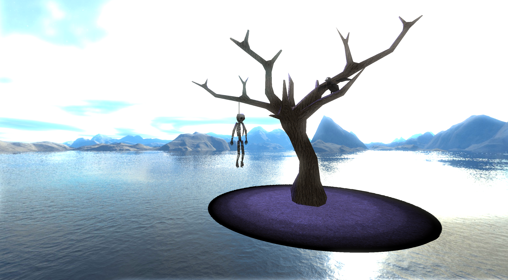
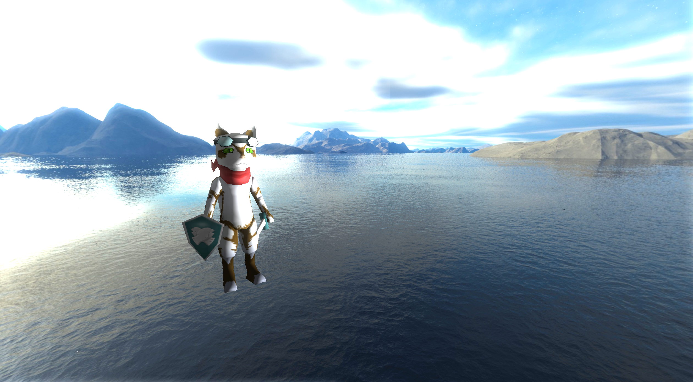

# CyEngine

<p align="center">

</p>

Programmed in C++, CyEngine is a university project aiming to combine and implement OpenGL graphics, rudamentary </br>
physics, and a shader pipeline, in tandem with an exploration of game engine architecture and its components.</br>




You can find out more by reading the assignment report - [here.](https://drive.google.com/file/d/1DyAeilZvoHSlmYx-dCd69AUH2iZKmdeB/view?usp=sharing) </br>
## Gameplay

The console will print two sets of position coordinates: </br>
  1.) Your own position,</br> 
  2.) A model's position.</br>
Using this information, track down and locate the model. Once collided with, the model will teleport to a new </br>
location.

## Inputs

Move Forward - 'W' \
Move Left - 'A' \
Move Back - 'S' \
Move Right - 'D' \
Move Up - 'Q' \
Move Down - 'E' \
Increase Speed - 'Shift' \
Spawn Sphere - 'P'

## Getting Started

To make use of OpenGL functionality, the program must first have a window (made via GLFW) and a \
 valid OpenGL context:

```cpp
// Create window and assign OpenGL context:
glm::ivec2 window_size{ 1000, 1000 };
GLFWwindow* window = Gp::CreateWindow(window_size);
glfwMakeContextCurrent(window);

// Create context:
std::shared_ptr<GpContext> context = Gp::CreateContext();
std::shared_ptr<PhContext> phy_context = Ph::CreateContext();
```
## Shaders

A shader contains two shader source files: </br>
  1.) A vertex shader source, </br>
  2.) A fragment shader source. \
Game objects are rendered via Shader::Render():

```cpp
// Create Shader for on-screen rendering:
std::shared_ptr<Shader> shader = context->CreateShader(light_v, light_f);
```

## Camera

A camera object must be specified to view the scene. Setting it at the main camera (via the context class)\
will provide the user with input control of said camera:

```cpp
std::shared_ptr<Camera> main_cam = context->CreateCamera(
        false,                        // orthographic?
        glm::vec2((float)window_size.x, (float)window_size.y),  // size of frustum
        glm::vec3(0.0f, 0.0f, 0.0f),  // position
        glm::vec3(0.0f, 0.0f, 1.0f),  // target
        70.0f                         //fov
    );
context->SetMainCamera(main_cam); // "Main Camera" can be controlled by the user
```

## Loading in Meshes

Meshes can be loaded into the engine via a wavefront.obj mesh loader. Note: the model loader\
can only grant access to one texture per mesh, baking all textures into one diffuse map is advised:

```cpp
// Create curuthers gameobject:
const GLchar* model_filepath = "Additional_Files/models/curuthers/curuthers.obj";
std::shared_ptr<Mesh> curuthers_m = context->CreateMesh(model_filepath);
```

## GameObjects

Game objects are passed to the renderer and must hold a mesh: 

```cpp
// Create gameobject:
std::shared_ptr<GameObject> curuthers = context->CreateGameObject(curuthers_m);
```

Each game object contains a Transform component, allowing the user to edit position, scale, and rotation:

```cpp
// Edit position:
curuthers->SetPos(glm::vec3(
        distr(gen),
        distr(gen),
        distr(gen)));
// Edit scale:
curuthers->Scale(glm::vec3(0.4f, 0.4f, 0.4f));
// Edit name:
curuthers->name = "curuthers";

// Add game object to shader object for rendering:
shader->AddGameObject(curuthers);
```

## Render Loop

Here, objects are rendered and input is read:

```cpp
while (!glfwWindowShouldClose(window))
    {
        // Calc delta time:
        float delta_time = context->CalcDeltaTime();
            
        // Input:
        context->ProcessInput(window, delta_time);

        // Render:
        shader->Render(main_cam, render_texture, true);
    
        // Swap buffers:
        glfwSwapBuffers(window);
        glfwPollEvents();
    }

    // Clean up:
    glfwTerminate();
    return 0;
```

## Resources
OpenGL: https://www.opengl.org/</br>
GLEW: https://glew.sourceforge.net/</br>
GLFW: https://www.glfw.org/</br>


